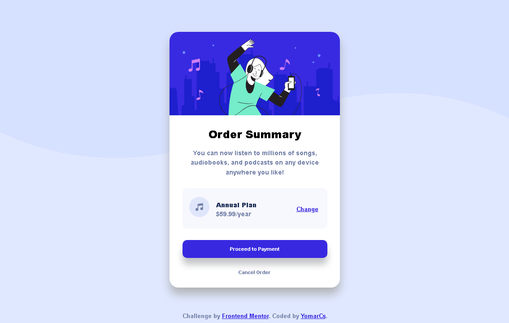

# Order summary card solution

Live Site URL: [https://yomarcs.github.io/order-summary-component/](https://yomarcs.github.io/order-summary-component/)

This is a solution to the [Order summary card challenge on Frontend Mentor](https://www.frontendmentor.io/challenges/order-summary-component-QlPmajDUj). Frontend Mentor challenges help you improve your coding skills by building realistic projects. 

## Table of contents

- [Order summary card solution](#order-summary-card-solution)
  - [Table of contents](#table-of-contents)
    - [Screenshot](#screenshot)
    - [Links](#links)
    - [Built with](#built-with)
  - [Author](#author)

### Screenshot

### Links

- Solution URL: [https://github.com/yomarcs/FrontEndMentor-Challengers/blob/main/Newbie/1.%20order-summary/v2](https://github.com/yomarcs/FrontEndMentor-Challengers/tree/main/Newbie/1.%20order-summary/v2)
- Live Site URL: [https://yomarcs.github.io/order-summary-component/](https://yomarcs.github.io/order-summary-component/)

### Built with

- Semantic HTML5 markup
- CSS custom properties
- Flexbox

## Author

- Frontend Mentor - [@yomarcs](https://www.frontendmentor.io/profile/yomarcs)
- Github - [@yomarcs](https://github.com/yomarcs)

